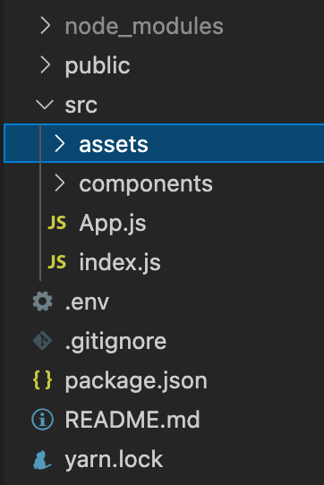
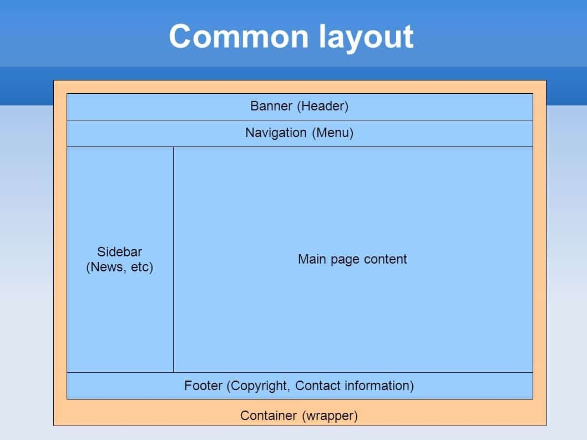
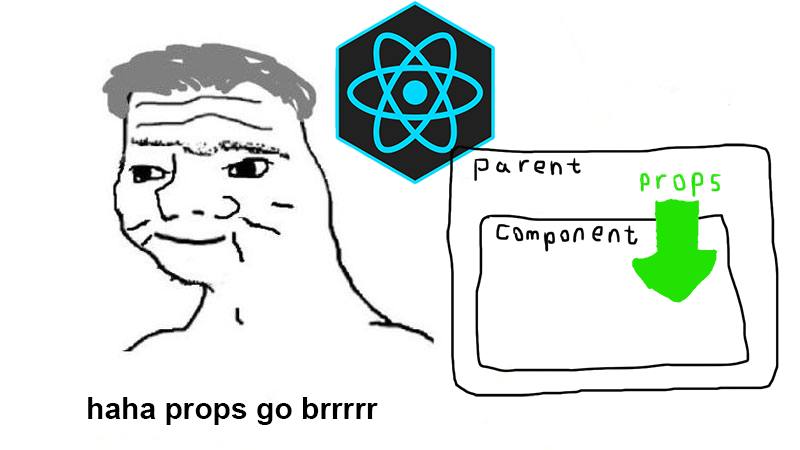

# Intro to React

### **What is React?**
> React is a declarative, efficient, and flexible JavaScript library for building user interfaces. It lets you compose complex UIs from small and isolated pieces of code called “components”. ([Reactjs.org](https://reactjs.org/tutorial/tutorial.html))

* React is a library written with JavaScript. It is designed to make writing JavaScript clean and efficient.

### **Some React Features**
* Virtual DOM
* Components
* Auto-Refresh/Live Server
* Imports

### **VSCode Extensions**
  * JS JSX Snippets
  * Simple React Snippets

### **Debugging**
  * You'll continue to use `console.log` and `debugger`, but there are some additional tools.
  * React Developer Tools
  * Redux Developer Tools

### **Creating a React project**
* `npx create-react-app <project-name>`
* You may see labs or older resources online telling you to use this command:  `npm install -g create-react-app`. You shouldn't need to if you have more recent versions of node installed.
* `npm start` or `yarn start` to start live server.

### **React Project Structure**

&nbsp; 

&nbsp; 

* `public`
  - We do very little work in this folder. We would maybe edit the `head` section of `index.html`.
* `src`
  - This is where our project lives.
  - Some freedom with the organization of files/folders.
  - `create-react-app` gives us some files we won't be using, it's okay to delete them. Just make sure to clean up anywhere there are imports for those files.
  - `index.js` sets up our virtual DOM.
  - `app.js` is usually our root page, but it does not have to be.

### **package.json, node_modules, Babel & Webpack**
  * `package.json` is kind of like our `Gemfile` in Ruby. We can add extra tools to our project with packages.
    - `npm install` or `yarn install` create `package-lock.json` and `yarn.lock` respectively.
  * `node_modules` is where the code for all of those packages exist.
  * Babel is a package that converts all of our JSX into code that is compatible with any browser.
  * Webpack bundles all of our files together. It minifies some of them, shrinks file sizes and makes our project more digestible for the browser.

### **JSX - JavaScript Extension Syntax**
  * Used to easily write JavaScript and HTML together.
  * It LOOKS like HTML, but it is not. (Think back to our `.erb` files in Sinatra & Rails.)
  * Allows us to write JS code directly inside of our "HTML".
  * With JSX, EVERY HTML tag needs a closing tag (i.e. `<input />`, ``).
  * Everything needs to be grouped inside of 1 tag. 

### **Components**
  * Independent and reusable bits of code (kind of like functions!)

  &nbsp; 
  &nbsp; 

  

  &nbsp; 

  

  &nbsp;

  * Class Components
  * Functional Components
  * Container Components

### **Props**
  &nbsp;

  

  &nbsp;

  * Short for properties
  * Built-in object that stores the value of a tag's attribute (similar to HTML attributes).
  * Provides a way to pass data from one component to another. (Similar to arguments in a function)
  * Cannot be changed or updated in the child component.
  * Props cannot be passed from child to parent.

### **Resources**
  * [React Documentation](https://reactjs.org/)
  * [npmjs.com](https://www.npmjs.com/)
  * [React Developer Tools](https://chrome.google.com/webstore/detail/react-developer-tools/fmkadmapgofadopljbjfkapdkoienihi?hl=en)
  * [Redux Developer Tools](https://chrome.google.com/webstore/detail/redux-devtools/lmhkpmbekcpmknklioeibfkpmmfibljd?hl=en)